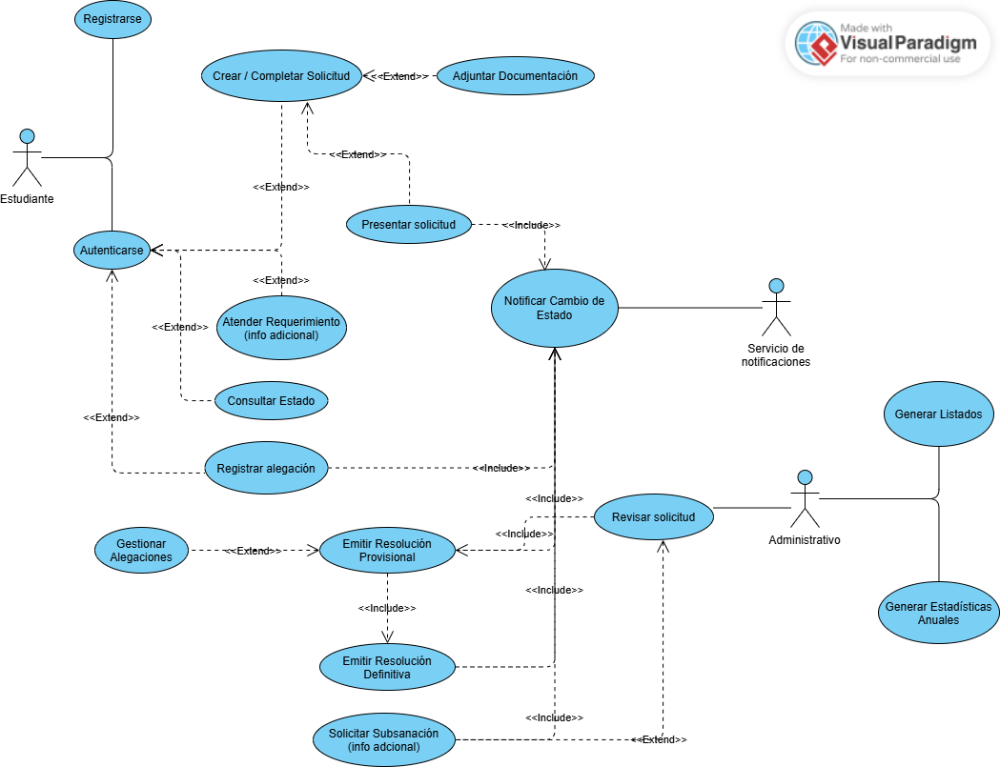

# Solución - Sistema de Gestión de Solicitudes de Becas Universitarias

## Actores del sistema

* **Estudiante**: solicita la beca, aporta documentación, consulta estado y presenta alegaciones.
* **Personal administrativo**: revisa solicitudes, solicita subsanaciones/información adicional, emite resoluciones y genera listados/estadísticas.
* **Servicio de notificaciones (externo)** *(actor secundario)*: canal para el envío de avisos (correo/SMS/app).

## Requisitos funcionales (RF)

* **RF-01** Permitir el registro de estudiantes en el sistema.

* **RF-02** Permitir la autenticación de estudiantes registrados.

* **RF-03** Permitir al estudiante crear y completar un formulario de solicitud de beca.

* **RF-04** Permitir al estudiante adjuntar documentación requerida a la solicitud.

* **RF-05** Permitir al estudiante enviar (presentar) la solicitud para su tramitación.

* **RF-06** Permitir al estudiante consultar el estado de su solicitud.

* **RF-07** Permitir al personal administrativo consultar y acceder a solicitudes presentadas.

* **RF-08** Permitir al personal administrativo revisar solicitudes y registrar el resultado de la revisión.

* **RF-09** Permitir al personal administrativo solicitar información adicional/subsanación asociada a una solicitud.

* **RF-10** Permitir al estudiante aportar información/documentación adicional solicitada.

* **RF-11** Permitir al personal administrativo emitir una **resolución provisional** de una solicitud.

* **RF-12** Permitir al personal administrativo emitir una **resolución definitiva** de una solicitud.

* **RF-13** Permitir al sistema registrar alegaciones del estudiante dentro de un plazo asociado a la resolución provisional.

* **RF-14** Permitir al personal administrativo consultar y gestionar alegaciones recibidas.

* **RF-15** Notificar al estudiante cada cambio relevante del expediente (p. ej., solicitud presentada, requerimiento de subsanación, resoluciones, registro de alegación).

* **RF-16** Permitir la generación de listados de beneficiarios de becas.

* **RF-17** Permitir la generación de estadísticas anuales sobre concesión de becas.

## Requisitos no funcionales (RNF) clasificados

### Seguridad y privacidad

* **RNF-01 (Seguridad)** Garantizar autenticación para el acceso de estudiantes y personal administrativo.

* **RNF-02 (Seguridad)** Aplicar control de acceso por roles (estudiante / administrativo) a las funcionalidades y datos.

* **RNF-03 (Privacidad)** Proteger datos personales y documentación mediante cifrado en tránsito (p. ej., TLS) y medidas de protección en almacenamiento.

* **RNF-04 (Trazabilidad/Auditoría)** Registrar trazas de acciones relevantes (presentación, revisiones, resoluciones, solicitudes de subsanación, alegaciones y notificaciones).

### Rendimiento y capacidad

* **RNF-05 (Rendimiento)** Responder a consultas de estado y acceso a solicitudes en tiempos aceptables bajo carga habitual (objetivo institucional; medible en pruebas).

* **RNF-06 (Capacidad)** Soportar picos de presentación de solicitudes en periodos de convocatoria sin degradación crítica del servicio.

### Disponibilidad y fiabilidad

* **RNF-07 (Disponibilidad)** Mantener una disponibilidad acorde al calendario de convocatorias, con especial atención a fechas límite.

* **RNF-08 (Fiabilidad)** Garantizar integridad de ficheros adjuntos y consistencia de estados de solicitud.

### Usabilidad y accesibilidad

* **RNF-09 (Usabilidad)** Proporcionar formularios guiados con validación de campos y mensajes de error comprensibles.

* **RNF-10 (Accesibilidad)** Cumplir pautas de accesibilidad web aplicables en el entorno universitario (p. ej., WCAG nivel institucional).

### Mantenibilidad y configurabilidad

* **RNF-11 (Configurabilidad)** Permitir parametrizar plazos (p. ej., plazo de alegaciones) y calendarios de convocatoria.

* **RNF-12 (Mantenibilidad)** Documentar interfaces y mantener una arquitectura modular que facilite evolución (nuevos tipos de beca/documentos).

## Diagrama de casos de uso (PlantUML)

## Casos de uso en formato expandido

### UC-01 — Registrarse

| Campo                      | Contenido                                                                                                                                                                                           |
| -------------------------- | --------------------------------------------------------------------------------------------------------------------------------------------------------------------------------------------------- |
| **Identificador**          | UC-01                                                                                                                                                                                               |
| **Nombre**                 | Registrarse                                                                                                                                                                                         |
| **Actor principal**        | Estudiante                                                                                                                                                                                          |
| **Descripción**            | Permite al estudiante crear una cuenta en el sistema para iniciar trámites de beca.                                                                                                                 |
| **Flujo principal**        | 1. Acceder a “Registro”. 2. El sistema solicita datos de registro. 3. Introducir datos requeridos. 4. El sistema valida los datos. 5. El sistema crea la cuenta y confirma el registro. |
| **Flujos alternativos**    | **A1. Datos inválidos/incompletos**: el sistema informa; el estudiante corrige y reintenta. **A2. Usuario ya registrado**: el sistema informa y finaliza.                                        |
| **Reglas de negocio**      | No aplica.                                                                                                                                                                                          |
| **Requisitos funcionales** | RF-01                                                                                                                                                                                               |

### UC-02 — Autenticarse

| Campo                      | Contenido                                                                                           |
| -------------------------- | --------------------------------------------------------------------------------------------------- |
| **Identificador**          | UC-02                                                                                               |
| **Nombre**                 | Autenticarse                                                                                        |
| **Actor principal**        | Estudiante                                                                                          |
| **Descripción**            | Permite al estudiante acceder al sistema mediante credenciales.                                     |
| **Flujo principal**        | 1. Introducir credenciales. 2. El sistema verifica credenciales. 3. El sistema inicia sesión. |
| **Flujos alternativos**    | **A1. Credenciales incorrectas**: el sistema rechaza el acceso e informa.                           |
| **Reglas de negocio**      | No aplica.                                                                                          |
| **Requisitos funcionales** | RF-02                                                                                               |

### UC-03 — Crear/Completar solicitud

| Campo                      | Contenido                                                                                                                                                                            |
| -------------------------- | ------------------------------------------------------------------------------------------------------------------------------------------------------------------------------------ |
| **Identificador**          | UC-03                                                                                                                                                                                |
| **Nombre**                 | Crear/Completar solicitud                                                                                                                                                            |
| **Actor principal**        | Estudiante                                                                                                                                                                           |
| **Descripción**            | Permite cumplimentar el formulario de solicitud de beca.                                                                                                                             |
| **Flujo principal**        | 1. Iniciar nueva solicitud. 2. El sistema muestra el formulario. 3. Completar campos requeridos. 4. El sistema valida la información. 5. El sistema guarda la solicitud. |
| **Flujos alternativos**    | **A1. Validación fallida**: el sistema indica errores; el estudiante corrige.                                                                                                        |
| **Reglas de negocio**      | No aplica (criterios no especificados).                                                                                                                                              |
| **Requisitos funcionales** | RF-03                                                                                                                                                                                |

### UC-04 — Adjuntar documentación

| Campo                      | Contenido                                                                                                                                                                                           |
| -------------------------- | --------------------------------------------------------------------------------------------------------------------------------------------------------------------------------------------------- |
| **Identificador**          | UC-04                                                                                                                                                                                               |
| **Nombre**                 | Adjuntar documentación                                                                                                                                                                              |
| **Actor principal**        | Estudiante                                                                                                                                                                                          |
| **Descripción**            | Permite adjuntar a la solicitud la documentación requerida (expediente, justificantes económicos, etc.).                                                                                            |
| **Flujo principal**        | 1. Acceder a la sección de documentación. 2. El sistema muestra tipos requeridos. 3. Cargar ficheros. 4. El sistema verifica incorporación correcta. 5. El sistema confirma la anexión. |
| **Flujos alternativos**    | **A1. Error de carga/fichero no válido**: el sistema informa; reintento.                                                                                                                            |
| **Reglas de negocio**      | No aplica (formatos/tamaños no definidos).                                                                                                                                                          |
| **Requisitos funcionales** | RF-04                                                                                                                                                                                               |

### UC-05 — Presentar solicitud

| Campo                      | Contenido                                                                                                                                                                                                                   |
| -------------------------- | --------------------------------------------------------------------------------------------------------------------------------------------------------------------------------------------------------------------------- |
| **Identificador**          | UC-05                                                                                                                                                                                                                       |
| **Nombre**                 | Presentar solicitud                                                                                                                                                                                                         |
| **Actor principal**        | Estudiante                                                                                                                                                                                                                  |
| **Descripción**            | Permite enviar formalmente la solicitud para su tramitación administrativa.                                                                                                                                                 |
| **Flujo principal**        | 1. Seleccionar “Presentar solicitud”. 2. El sistema verifica completitud (formulario y documentación). 3. El sistema registra la presentación y cambia estado a “Presentada”. 4. **Incluye UC-16** (notificación). |
| **Flujos alternativos**    | **A1. Solicitud incompleta**: el sistema informa de pendientes; no presenta.                                                                                                                                                |
| **Reglas de negocio**      | **RN-01** Solo se puede presentar si cumple completitud mínima (campos y adjuntos requeridos).                                                                                                                              |
| **Requisitos funcionales** | RF-05, RF-15                                                                                                                                                                                                                |

### UC-06 — Consultar estado

| Campo                      | Contenido                                                                                                                                                              |
| -------------------------- | ---------------------------------------------------------------------------------------------------------------------------------------------------------------------- |
| **Identificador**          | UC-06                                                                                                                                                                  |
| **Nombre**                 | Consultar estado                                                                                                                                                       |
| **Actor principal**        | Estudiante                                                                                                                                                             |
| **Descripción**            | Permite consultar el estado actualizado de la solicitud y su información asociada.                                                                                     |
| **Flujo principal**        | 1. Acceder a “Mis solicitudes”. 2. El sistema lista solicitudes y estados. 3. Seleccionar una solicitud. 4. El sistema muestra detalle e historial relevante. |
| **Flujos alternativos**    | **A1. Sin solicitudes**: el sistema informa y finaliza.                                                                                                                |
| **Reglas de negocio**      | No aplica.                                                                                                                                                             |
| **Requisitos funcionales** | RF-06                                                                                                                                                                  |

### UC-07 — Atender requerimiento (Aportar info adicional)

| Campo                      | Contenido                                                                                                                                                                                             |
| -------------------------- | ----------------------------------------------------------------------------------------------------------------------------------------------------------------------------------------------------- |
| **Identificador**          | UC-07                                                                                                                                                                                                 |
| **Nombre**                 | Atender requerimiento (Aportar info adicional)                                                                                                                                                        |
| **Actor principal**        | Estudiante                                                                                                                                                                                            |
| **Descripción**            | Permite aportar información/documentación adicional solicitada por el personal administrativo.                                                                                                        |
| **Flujo principal**        | 1. Visualizar requerimiento asociado. 2. Adjuntar/introducir la información solicitada. 3. El sistema registra la aportación y actualiza el expediente. 4. **Incluye UC-16** (notificación). |
| **Flujos alternativos**    | **A1. Error al adjuntar**: el sistema informa; reintento.                                                                                                                                             |
| **Reglas de negocio**      | No aplica (plazos no especificados).                                                                                                                                                                  |
| **Requisitos funcionales** | RF-10, RF-15                                                                                                                                                                                          |

### UC-08 — Registrar alegación

| Campo                      | Contenido                                                                                                                                                                                                                                                                                             |
| -------------------------- | ----------------------------------------------------------------------------------------------------------------------------------------------------------------------------------------------------------------------------------------------------------------------------------------------------- |
| **Identificador**          | UC-08                                                                                                                                                                                                                                                                                                 |
| **Nombre**                 | Registrar alegación                                                                                                                                                                                                                                                                                   |
| **Actor principal**        | Estudiante                                                                                                                                                                                                                                                                                            |
| **Descripción**            | Permite registrar una alegación vinculada a la resolución provisional dentro del plazo establecido.                                                                                                                                                                                                   |
| **Flujo principal**        | 1. Acceder al detalle de la resolución provisional. 2. El sistema habilita “Registrar alegación” si el plazo está vigente. 3. Redactar alegación y adjuntar documentación si aplica. 4. El sistema registra la alegación y la asocia a la solicitud. 5. **Incluye UC-16** (notificación). |
| **Flujos alternativos**    | **A1. Plazo expirado**: el sistema bloquea e informa. **A2. Datos incompletos**: el sistema solicita corrección.                                                                                                                                                                                   |
| **Reglas de negocio**      | **RN-02** Solo se admiten alegaciones dentro del plazo configurado desde la resolución provisional.                                                                                                                                                                                                   |
| **Requisitos funcionales** | RF-13, RF-15                                                                                                                                                                                                                                                                                          |

### UC-09 — Revisar solicitud

| Campo                      | Contenido                                                                                                                                                                                                               |
| -------------------------- | ----------------------------------------------------------------------------------------------------------------------------------------------------------------------------------------------------------------------- |
| **Identificador**          | UC-09                                                                                                                                                                                                                   |
| **Nombre**                 | Revisar solicitud                                                                                                                                                                                                       |
| **Actor principal**        | Personal administrativo                                                                                                                                                                                                 |
| **Descripción**            | Permite revisar solicitudes presentadas, verificando consistencia y documentación.                                                                                                                                      |
| **Flujo principal**        | 1. Acceder al listado de solicitudes. 2. El sistema muestra solicitud y adjuntos. 3. Revisar información y documentación. 4. Registrar resultado de la revisión. 5. El sistema actualiza el estado interno. |
| **Flujos alternativos**    | **A1. Falta información**: **extiende UC-10** (solicitar subsanación).                                                                                                                                                  |
| **Reglas de negocio**      | No aplica (criterios no especificados).                                                                                                                                                                                 |
| **Requisitos funcionales** | RF-07, RF-08                                                                                                                                                                                                            |

### UC-10 — Solicitar subsanación/información adicional

| Campo                      | Contenido                                                                                                                                                                                                                                                      |
| -------------------------- | -------------------------------------------------------------------------------------------------------------------------------------------------------------------------------------------------------------------------------------------------------------- |
| **Identificador**          | UC-10                                                                                                                                                                                                                                                          |
| **Nombre**                 | Solicitar subsanación/información adicional                                                                                                                                                                                                                    |
| **Actor principal**        | Personal administrativo                                                                                                                                                                                                                                        |
| **Descripción**            | Permite emitir un requerimiento al estudiante para aportar información/documentación adicional.                                                                                                                                                                |
| **Flujo principal**        | 1. Seleccionar “Solicitar información adicional”. 2. El sistema solicita detalle del requerimiento. 3. Registrar descripción de lo solicitado. 4. El sistema registra el requerimiento y actualiza el estado. 5. **Incluye UC-16** (notificación). |
| **Flujos alternativos**    | **A1. Cancelación**: se cancela antes de confirmar y no se registra.                                                                                                                                                                                           |
| **Reglas de negocio**      | No aplica.                                                                                                                                                                                                                                                     |
| **Requisitos funcionales** | RF-09, RF-15                                                                                                                                                                                                                                                   |

### UC-11 — Emitir resolución provisional

| Campo                      | Contenido                                                                                                                                                                                                                                 |
| -------------------------- | ----------------------------------------------------------------------------------------------------------------------------------------------------------------------------------------------------------------------------------------- |
| **Identificador**          | UC-11                                                                                                                                                                                                                                     |
| **Nombre**                 | Emitir resolución provisional                                                                                                                                                                                                             |
| **Actor principal**        | Personal administrativo                                                                                                                                                                                                                   |
| **Descripción**            | Permite registrar una resolución provisional para una solicitud.                                                                                                                                                                          |
| **Flujo principal**        | 1. Seleccionar solicitud apta. 2. Introducir resultado provisional. 3. El sistema registra la resolución provisional y fecha. 4. El sistema habilita periodo de alegaciones (si aplica). 5. **Incluye UC-16** (notificación). |
| **Flujos alternativos**    | **A1. Solicitud no apta**: el sistema impide emitir resolución e informa.                                                                                                                                                                 |
| **Reglas de negocio**      | **RN-03** La emisión de resolución provisional habilita el cómputo del plazo de alegaciones.                                                                                                                                              |
| **Requisitos funcionales** | RF-11, RF-15                                                                                                                                                                                                                              |

### UC-12 — Emitir resolución definitiva

| Campo                      | Contenido                                                                                                                                                                                                                                                           |
| -------------------------- | ------------------------------------------------------------------------------------------------------------------------------------------------------------------------------------------------------------------------------------------------------------------- |
| **Identificador**          | UC-12                                                                                                                                                                                                                                                               |
| **Nombre**                 | Emitir resolución definitiva                                                                                                                                                                                                                                        |
| **Actor principal**        | Personal administrativo                                                                                                                                                                                                                                             |
| **Descripción**            | Permite registrar la resolución definitiva tras revisión final y, en su caso, tras gestionar alegaciones.                                                                                                                                                           |
| **Flujo principal**        | 1. Seleccionar solicitud con resolución provisional. 2. Revisar expediente y (si aplica) alegaciones. 3. Registrar resultado definitivo. 4. El sistema registra la resolución definitiva y actualiza estado final. 5. **Incluye UC-16** (notificación). |
| **Flujos alternativos**    | **A1. Plazo de alegaciones vigente**: el sistema impide la resolución definitiva.                                                                                                                                                                                   |
| **Reglas de negocio**      | **RN-04** No emitir resolución definitiva antes de finalizar el plazo de alegaciones o sin gestionar alegaciones presentadas.                                                                                                                                       |
| **Requisitos funcionales** | RF-12, RF-15                                                                                                                                                                                                                                                        |

### UC-13 — Gestionar alegaciones

| Campo                      | Contenido                                                                                                                                                                                                               |
| -------------------------- | ----------------------------------------------------------------------------------------------------------------------------------------------------------------------------------------------------------------------- |
| **Identificador**          | UC-13                                                                                                                                                                                                                   |
| **Nombre**                 | Gestionar alegaciones                                                                                                                                                                                                   |
| **Actor principal**        | Personal administrativo                                                                                                                                                                                                 |
| **Descripción**            | Permite consultar y registrar el tratamiento de alegaciones asociadas a solicitudes.                                                                                                                                    |
| **Flujo principal**        | 1. Acceder a bandeja de alegaciones. 2. El sistema lista alegaciones por solicitud. 3. Revisar contenido y adjuntos. 4. Registrar resultado/observaciones. 5. El sistema asocia el resultado al expediente. |
| **Flujos alternativos**    | **A1. Alegación incompleta**: registrar observación sin cambios adicionales.                                                                                                                                            |
| **Reglas de negocio**      | No aplica.                                                                                                                                                                                                              |
| **Requisitos funcionales** | RF-14                                                                                                                                                                                                                   |

### UC-14 — Generar listado de beneficiarios

| Campo                      | Contenido                                                                                                                             |
| -------------------------- | ------------------------------------------------------------------------------------------------------------------------------------- |
| **Identificador**          | UC-14                                                                                                                                 |
| **Nombre**                 | Generar listado de beneficiarios                                                                                                      |
| **Actor principal**        | Personal administrativo                                                                                                               |
| **Descripción**            | Permite generar un listado de beneficiarios según resoluciones definitivas.                                                           |
| **Flujo principal**        | 1. Seleccionar periodo/convocatoria. 2. Filtrar resoluciones definitivas favorables. 3. Generar listado. 4. Mostrar listado. |
| **Flujos alternativos**    | **A1. Sin beneficiarios**: informar y mostrar listado vacío.                                                                          |
| **Reglas de negocio**      | No aplica.                                                                                                                            |
| **Requisitos funcionales** | RF-16                                                                                                                                 |

### UC-15 — Generar estadísticas anuales

| Campo                      | Contenido                                                                                         |
| -------------------------- | ------------------------------------------------------------------------------------------------- |
| **Identificador**          | UC-15                                                                                             |
| **Nombre**                 | Generar estadísticas anuales                                                                      |
| **Actor principal**        | Personal administrativo                                                                           |
| **Descripción**            | Permite obtener estadísticas agregadas anuales sobre solicitudes y concesiones.                   |
| **Flujo principal**        | 1. Seleccionar año/convocatoria. 2. Calcular métricas agregadas. 3. Presentar estadísticas. |
| **Flujos alternativos**    | **A1. Datos insuficientes**: informar y mostrar lo disponible.                                    |
| **Reglas de negocio**      | No aplica.                                                                                        |
| **Requisitos funcionales** | RF-17                                                                                             |

### UC-16 — Notificar cambio de estado

| Campo                      | Contenido                                                                                                                                                                            |
| -------------------------- | ------------------------------------------------------------------------------------------------------------------------------------------------------------------------------------ |
| **Identificador**          | UC-16                                                                                                                                                                                |
| **Nombre**                 | Notificar cambio de estado                                                                                                                                                           |
| **Actor principal**        | Servicio de notificaciones (externo)                                                                                                                                                 |
| **Descripción**            | Envía una notificación al estudiante cuando se produce un cambio relevante en el expediente.                                                                                         |
| **Flujo principal**        | 1. El sistema compone el mensaje de cambio. 2. Invoca el servicio de notificaciones. 3. El servicio entrega la notificación. 4. El sistema registra el resultado del envío. |
| **Flujos alternativos**    | **A1. Fallo de entrega**: registrar fallo para reintento y/o constancia de no entrega.                                                                                               |
| **Reglas de negocio**      | **RN-05** Notificar cada cambio relevante del expediente al estudiante.                                                                                                              |
| **Requisitos funcionales** | RF-15                                                                                                                                                                                |

## Matriz de trazabilidad

| Requisito | Descripción resumida                                         | Caso de uso principal (ID – Nombre)                        |
| --------- | ------------------------------------------------------------ | ---------------------------------------------------------- |
| **RF-01** | Permitir el registro de estudiantes                          | **UC-01 – Registrarse**                                    |
| **RF-02** | Permitir la autenticación de estudiantes                     | **UC-02 – Autenticarse**                                   |
| **RF-03** | Crear y completar formulario de solicitud                    | **UC-03 – Crear/Completar solicitud**                      |
| **RF-04** | Adjuntar documentación requerida                             | **UC-04 – Adjuntar documentación**                         |
| **RF-05** | Presentar solicitud para tramitación                         | **UC-05 – Presentar solicitud**                            |
| **RF-06** | Consultar estado de la solicitud                             | **UC-06 – Consultar estado**                               |
| **RF-07** | Permitir al administrativo consultar solicitudes presentadas | **UC-09 – Revisar solicitud**                              |
| **RF-08** | Revisar solicitudes y registrar resultado                    | **UC-09 – Revisar solicitud**                              |
| **RF-09** | Solicitar información adicional/subsanación                  | **UC-10 – Solicitar subsanación/información adicional**    |
| **RF-10** | Aportar información/documentación adicional solicitada       | **UC-07 – Atender requerimiento (Aportar info adicional)** |
| **RF-11** | Emitir resolución provisional                                | **UC-11 – Emitir resolución provisional**                  |
| **RF-12** | Emitir resolución definitiva                                 | **UC-12 – Emitir resolución definitiva**                   |
| **RF-13** | Registrar alegaciones dentro de plazo                        | **UC-08 – Registrar alegación**                            |
| **RF-14** | Consultar y gestionar alegaciones                            | **UC-13 – Gestionar alegaciones**                          |
| **RF-15** | Notificar cada cambio al estudiante                          | **UC-16 – Notificar cambio de estado**                     |
| **RF-16** | Generar listados de beneficiarios                            | **UC-14 – Generar listado de beneficiarios**               |
| **RF-17** | Generar estadísticas anuales de concesión                    | **UC-15 – Generar estadísticas anuales**                   |
