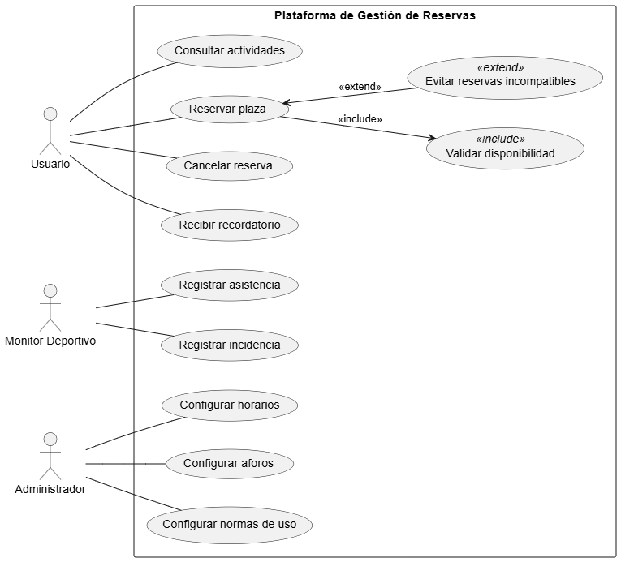

# Plataforma de Gestión de Reservas de Actividades Deportivas

## Caso práctico

El servicio deportivo de una universidad necesita una plataforma para gestionar la reserva de actividades y de instalaciones deportivas.

Los usuarios pueden consultar actividades (pádel, gimnasio, natación, clases dirigidas), reservar plazas y cancelarlas dentro del plazo permitido.

Los monitores deportivos gestionan la asistencia y registran incidencias. Los administradores configuran horarios, aforos y normas de uso.

El sistema debe controlar el número máximo de participantes, impedir reservas simultáneas incompatibles y enviar recordatorios automáticos antes de cada actividad.

Claro, aquí tienes los **requisitos funcionales y no funcionales** derivados del caso práctico de la **Plataforma de Gestión de Reservas de Actividades Deportivas** para el servicio deportivo de una universidad:

## Requisitos

### Requisitos funcionales

1. **Consultar actividades deportivas:**
   Los usuarios podrán visualizar un listado actualizado de actividades disponibles (pádel, gimnasio, natación, clases dirigidas), junto con sus horarios y plazas disponibles.

2. **Reservar plaza en una actividad:**
   Los usuarios podrán reservar su participación en una actividad, siempre que haya disponibilidad.

3. **Cancelar reservas dentro del plazo permitido:**
   Los usuarios podrán cancelar sus reservas si lo hacen antes de la fecha límite establecida por el sistema.

4. **Controlar aforo máximo por actividad:**
   El sistema debe impedir que se reserven más plazas de las permitidas para cada actividad.

5. **Evitar reservas simultáneas incompatibles:**
   El sistema debe detectar y bloquear reservas que se solapen en horario si son incompatibles.

6. **Enviar recordatorios automáticos:**
   El sistema enviará notificaciones a los usuarios antes de la hora de inicio de la actividad reservada.

7. **Registrar asistencia de participantes:**
   Los monitores deportivos podrán registrar la asistencia de los usuarios a las actividades realizadas.

8. **Registrar incidencias de la sesión:**
   Los monitores deportivos podrán dejar constancia de incidencias ocurridas durante las actividades.

9. **Configurar horarios de actividades:**
   Los administradores podrán crear, editar o eliminar los horarios en los que se ofrecen las actividades.

10. **Configurar aforos máximos:**
    Los administradores podrán establecer la cantidad máxima de participantes permitidos por actividad o instalación.

11. **Definir normas de uso:**
    Los administradores podrán introducir y actualizar las normas que regulan la participación y uso de las instalaciones.

### Requisitos no funcionales

1. **Seguridad de acceso y roles:**
   El sistema debe autenticar a los usuarios y asignar permisos según su rol (usuario, monitor, administrador).

2. **Disponibilidad y acceso multiplataforma:**
   La plataforma debe estar disponible las 24 horas, accesible desde ordenadores, tablets y móviles.

3. **Interfaz intuitiva y accesible:**
   La interfaz debe ser fácil de usar para cualquier tipo de usuario, incluyendo accesibilidad para personas con discapacidad.

4. **Consistencia en la gestión de horarios y solapamientos:**
   El sistema debe garantizar que los horarios definidos no entren en conflicto entre sí ni permitan dobles reservas no válidas.

5. **Escalabilidad del sistema:**
   El sistema debe soportar un número creciente de usuarios y actividades sin pérdida de rendimiento.

6. **Auditoría de acciones relevantes:**
   Toda modificación en aforos, normas, horarios, reservas y registros debe quedar registrada para trazabilidad.

## Diagrama de casos de uso

## Casos de uso en formato expandido

### Caso de Uso: Consultar actividades

| **Elemento**            | **Descripción**                                                                                                                              |
| ----------------------- | -------------------------------------------------------------------------------------------------------------------------------------------- |
| **Nombre**              | Consultar actividades                                                                                                                        |
| **Actor principal**     | Usuario                                                                                                                                      |
| **Requisito funcional** | RF1: Consultar actividades deportivas                                                                                                        |
| **Precondición**        | El usuario ha iniciado sesión en la plataforma                                                                                               |
| **Curso típico**        | 1. El usuario accede a la sección de actividades. 2. El sistema muestra un listado con horarios, tipos de actividad y plazas disponibles. |
| **Curso alternativo**   | Si no hay actividades disponibles, el sistema muestra un mensaje informativo.                                                                |

### Caso de Uso: Reservar plaza

| **Elemento**               | **Descripción**                                                                                                                                                                                                                                                                                                                                                                                            |
| -------------------------- | ---------------------------------------------------------------------------------------------------------------------------------------------------------------------------------------------------------------------------------------------------------------------------------------------------------------------------------------------------------------------------------------------------------- |
| **Nombre**                 | Reservar plaza                                                                                                                                                                                                                                                                                                                                                                                             |
| **Actor principal**        | Usuario                                                                                                                                                                                                                                                                                                                                                                                                    |
| **Requisitos funcionales** | **RF2** Reservar plaza en una actividad    **RF4** Controlar aforo máximo    **RF5** Evitar reservas simultáneas incompatibles                                                                                                                                                                                                                                                                       |
| **Precondición**           | El usuario ha iniciado sesión y ha consultado actividades                                                                                                                                                                                                                                                                                                                                                  |
| **Curso típico**           | 1. El usuario selecciona una actividad. 2. El sistema comprueba el aforo máximo configurado para la actividad (**RF4**). 3. El sistema verifica que el usuario no tiene otra reserva incompatible en el mismo horario (**RF5**). 4. El sistema muestra la disponibilidad. 5. El usuario confirma la reserva. 6. El sistema registra la reserva y actualiza el número de plazas disponibles. |
| **Curso alternativo 1**    | Si el aforo máximo está completo, el sistema impide la reserva y muestra un mensaje informativo (**RF4**).                                                                                                                                                                                                                                                                                                 |
| **Curso alternativo 2**    | Si existe una reserva incompatible en el mismo horario, el sistema bloquea la operación y notifica el conflicto (**RF5**).                                                                                                                                                                                                                                                                                 |

### Caso de Uso: Cancelar reserva

| **Elemento**            | **Descripción**                                                                                                                                                              |
| ----------------------- | ---------------------------------------------------------------------------------------------------------------------------------------------------------------------------- |
| **Nombre**              | Cancelar reserva                                                                                                                                                             |
| **Actor principal**     | Usuario                                                                                                                                                                      |
| **Requisito funcional** | RF3: Cancelar reservas dentro del plazo permitido                                                                                                                            |
| **Precondición**        | El usuario tiene una reserva activa dentro del plazo permitido                                                                                                               |
| **Curso típico**        | 1. El usuario accede a sus reservas activas. 2. Selecciona una reserva. 3. Solicita su cancelación. 4. El sistema elimina la reserva y actualiza la disponibilidad. |
| **Curso alternativo**   | Si el plazo de cancelación ha expirado, el sistema no permite cancelar y muestra un mensaje.                                                                                 |

### Caso de Uso: Recibir recordatorio

| **Elemento**            | **Descripción**                                                                                       |
| ----------------------- | ----------------------------------------------------------------------------------------------------- |
| **Nombre**              | Recibir recordatorio                                                                                  |
| **Actor principal**     | Usuario                                                                                               |
| **Requisito funcional** | RF6: Enviar recordatorios automáticos                                                                 |
| **Precondición**        | El usuario tiene una reserva registrada                                                               |
| **Curso típico**        | 1. El sistema detecta una actividad próxima. 2. Envía automáticamente una notificación al usuario. |
| **Curso alternativo**   | Si el usuario ha desactivado notificaciones, no se realiza el envío.                                  |

### Caso de Uso: Registrar asistencia

| **Elemento**            | **Descripción**                                                                                               |
| ----------------------- | ------------------------------------------------------------------------------------------------------------- |
| **Nombre**              | Registrar asistencia                                                                                          |
| **Actor principal**     | Monitor deportivo                                                                                             |
| **Requisito funcional** | RF7: Registrar asistencia de participantes                                                                    |
| **Precondición**        | La actividad se ha realizado                                                                                  |
| **Curso típico**        | 1. El monitor accede a la lista de inscritos. 2. Marca quién asistió. 3. El sistema guarda el registro. |
| **Curso alternativo**   | Si no hay inscritos, el sistema muestra un mensaje al monitor.                                                |

### Caso de Uso: Registrar incidencia

| **Elemento**            | **Descripción**                                                                                                                  |
| ----------------------- | -------------------------------------------------------------------------------------------------------------------------------- |
| **Nombre**              | Registrar incidencia                                                                                                             |
| **Actor principal**     | Monitor deportivo                                                                                                                |
| **Requisito funcional** | RF8: Registrar incidencias de la sesión                                                                                          |
| **Precondición**        | La actividad ya ha sido realizada                                                                                                |
| **Curso típico**        | 1. El monitor accede a la actividad. 2. Rellena un formulario describiendo la incidencia. 3. El sistema guarda el reporte. |
| **Curso alternativo**   | Si el formulario está incompleto, el sistema solicita los campos obligatorios.                                                   |

### Caso de Uso: Configurar horarios

| **Elemento**            | **Descripción**                                                                                                                    |
| ----------------------- | ---------------------------------------------------------------------------------------------------------------------------------- |
| **Nombre**              | Configurar horarios                                                                                                                |
| **Actor principal**     | Administrador                                                                                                                      |
| **Requisito funcional** | RF9: Configurar horarios de actividades                                                                                            |
| **Precondición**        | El administrador tiene acceso al panel de gestión                                                                                  |
| **Curso típico**        | 1. El administrador accede a la sección de horarios. 2. Crea, edita o elimina un horario. 3. El sistema actualiza los datos. |
| **Curso alternativo**   | Si el nuevo horario entra en conflicto con otro ya existente, el sistema emite una alerta.                                         |

### Caso de Uso: Configurar aforos

| **Elemento**            | **Descripción**                                                                                                                                                                    |
| ----------------------- | ---------------------------------------------------------------------------------------------------------------------------------------------------------------------------------- |
| **Nombre**              | Configurar aforos                                                                                                                                                                  |
| **Actor principal**     | Administrador                                                                                                                                                                      |
| **Requisito funcional** | RF10: Configurar aforos máximos                                                                                                                                                    |
| **Precondición**        | El administrador ha iniciado sesión                                                                                                                                                |
| **Curso típico**        | 1. El administrador selecciona una actividad o instalación. 2. Define el número máximo de participantes. 3. El sistema guarda el nuevo aforo y lo aplica a futuras reservas. |
| **Curso alternativo**   | Si el nuevo aforo es inferior a las reservas existentes, el sistema muestra una advertencia y solicita confirmación.                                                               |

### Caso de Uso: Configurar normas de uso

| **Elemento**            | **Descripción**                                                                                                              |
| ----------------------- | ---------------------------------------------------------------------------------------------------------------------------- |
| **Nombre**              | Configurar normas de uso                                                                                                     |
| **Actor principal**     | Administrador                                                                                                                |
| **Requisito funcional** | RF11: Definir normas de uso                                                                                                  |
| **Precondición**        | El administrador tiene permisos para modificar políticas                                                                     |
| **Curso típico**        | 1. Accede a la sección de normas. 2. Redacta o edita las reglas. 3. El sistema publica las nuevas normas en el portal. |
| **Curso alternativo**   | Si se omiten campos obligatorios, el sistema no permite guardar los cambios.                                                 |

## Matriz de trazabilidad de los casos de uso

| **ID Requisito Funcional** | **Descripción del Requisito Funcional**      | **Caso(s) de Uso que lo Satisfacen**                       |
| -------------------------- | -------------------------------------------- | ---------------------------------------------------------- |
| RF1                        | Consultar actividades deportivas             | Consultar actividades                                      |
| RF2                        | Reservar plaza en una actividad              | Reservar plaza                                             |
| RF3                        | Cancelar reservas dentro del plazo permitido | Cancelar reserva                                           |
| RF4                        | Controlar aforo máximo por actividad         | Configurar aforos, Reservar plaza *(<<include>> lógica)*   |
| RF5                        | Evitar reservas simultáneas incompatibles    | Reservar plaza *(<<extend>> a detección de incompatibles)* |
| RF6                        | Enviar recordatorios automáticos             | Recibir recordatorio                                       |
| RF7                        | Registrar asistencia de participantes        | Registrar asistencia                                       |
| RF8                        | Registrar incidencias de la sesión           | Registrar incidencia                                       |
| RF9                        | Configurar horarios de actividades           | Configurar horarios                                        |
| RF10                       | Configurar aforos máximos                    | Configurar aforos                                          |
| RF11                       | Definir normas de uso                        | Configurar normas de uso                                   |
