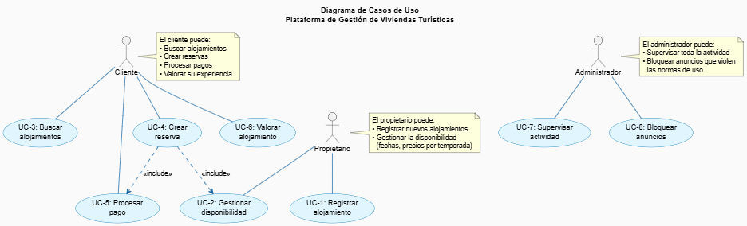

# Solución - Plataforma de Viviendas Turísticas

## Requisitos funcionales

| Código   | Requisito |
|----------|-----------|
| **RF-1** | Los propietarios pueden registrar alojamientos con fotos, descripción, capacidad, servicios y precios por temporada |
| **RF-2** | Los propietarios pueden definir disponibilidad y bloquear fechas específicas |
| **RF-3** | Los clientes pueden buscar alojamientos usando filtros (ubicación, capacidad, precio, servicios) |
| **RF-4** | Los clientes pueden realizar reservas y seleccionar fechas disponibles |
| **RF-5** | El sistema evita reservas duplicadas para las mismas fechas y calcula automáticamente el precio total |
| **RF-6** | El sistema procesa pagos en línea y genera confirmación de reserva automática para ambas partes |
| **RF-7** | Los huéspedes pueden valorar y comentar el alojamiento una vez finalizada la reserva |
| **RF-8** | Los administradores pueden supervisar actividad, bloquear anuncios y gestionar incidencias |

## Requisitos no funcionales

| Código    | Requisito |
|-----------|-----------|
| **RNF-1** | La plataforma debe ser **responsiva** y funcionar en móviles, tablets y escritorio |
| **RNF-2** | Los tiempos de respuesta en búsquedas no deben superar **2 segundos** |
| **RNF-3** | Disponibilidad del sistema **99.5%** durante el año con recuperación automática ante fallos |
| **RNF-4** | Todas las comunicaciones deben ser **cifradas (HTTPS)** y cumplir **RGPD** |
| **RNF-5** | Los datos de pago deben cumplir con **PCI DSS** y estar protegidos con cifrado |
| **RNF-6** | El sistema debe soportar **1,000 usuarios concurrentes** sin degradación de rendimiento |
| **RNF-7** | Las contraseñas se almacenarán con **hash criptográfico** y se implementará **2FA** opcional |

## Diagrama de casos de usos

## Formato expandido de los casos de uso

### UC-1: Registrar Alojamiento

| Campo | Contenido |
|-------|-----------|
| **Nombre** | Registrar Alojamiento |
| **Actor Primario** | Propietario |
| **Requisitos Satisfechos** | **RF-1:** Los propietarios pueden registrar alojamientos con fotos, descripción, capacidad, servicios y precios por temporada |
| **Descripción** | El propietario registra un nuevo alojamiento en la plataforma proporcionando información básica, fotos y características del inmueble. |
| **Precondiciones** | • El propietario debe estar registrado y autenticado en el sistema • El propietario debe haber completado su perfil con información personal |
| **Postcondiciones** | • El alojamiento se crea en estado "Borrador" • El propietario puede ver el alojamiento en su dashboard • El propietario puede continuar editando el alojamiento |
| **Flujo Principal** | 1. Propietario accede a su panel de control 2. Hace clic en "Nuevo Alojamiento" 3. Completa formulario con: nombre, dirección, tipo, capacidad, descripción 4. Sube mínimo 5 fotografías (máximo 50) 5. Selecciona servicios disponibles 6. Establece precio base por noche 7. Hace clic en "Guardar como Borrador" 8. Sistema confirma el registro exitoso |
| **Flujos Alternativos** | **2a. Carga desde plantilla:** - Selecciona "Cargar desde plantilla" - Sistema muestra plantillas prediseñadas - Completa datos restantes  **5a. Sube menos fotos:** - Sistema muestra advertencia - Puede continuar pero con menor visibilidad - Se recomienda agregar más fotos |

---

### UC-2: Gestionar Disponibilidad

| Campo | Contenido |
|-------|-----------|
| **Nombre** | Gestionar Disponibilidad |
| **Actor Primario** | Propietario |
| **Requisitos Satisfechos** | **RF-2:** Los propietarios pueden definir disponibilidad y bloquear fechas específicas |
| **Descripción** | El propietario define las fechas disponibles para reservas, configura temporadas con precios diferenciados y bloquea fechas específicas (mantenimiento, uso personal). |
| **Precondiciones** | • El propietario debe tener al menos un alojamiento registrado • El alojamiento debe estar publicado o en estado editable • El propietario debe estar autenticado |
| **Postcondiciones** | • Las fechas se actualizan en el calendario del sistema • Los precios por temporada quedan configurados • Las fechas bloqueadas no aparecen en búsquedas de clientes |
| **Flujo Principal** | 1. Propietario selecciona un alojamiento 2. Accede a pestaña "Disponibilidad" 3. Ve calendario de 12 meses 4. Define temporadas (Baja, Media, Alta) con multiplicador de precio 5. Bloquea fechas específicas indicando motivo 6. Establece número mínimo de noches 7. Hace clic en "Guardar cambios" 8. Sistema confirma actualización |
| **Flujos Alternativos** | **4a. Disponibilidad rápida:** - Carga archivo CSV con fechas y precios - Sistema valida formato - Importa automáticamente  **5a. Patrón recurrente:** - Selecciona "Bloqueo recurrente" - Define: cada X domingo, del X al Y de cada mes - Sistema aplica automáticamente |

---

### UC-3: Buscar Alojamientos

| Campo | Contenido |
|-------|-----------|
| **Nombre** | Buscar Alojamientos |
| **Actor Primario** | Cliente |
| **Requisitos Satisfechos** | **RF-3:** Los clientes pueden buscar alojamientos usando filtros (ubicación, capacidad, precio, servicios) |
| **Descripción** | El cliente busca alojamientos usando múltiples filtros (ubicación, fechas, capacidad, precio, servicios) y visualiza resultados en lista o mapa. |
| **Precondiciones** | • El cliente debe estar registrado (búsqueda sin autenticarse es posible) • Debe haber al menos 5 alojamientos publicados en el sistema |
| **Postcondiciones** | • Se muestran resultados según criterios de búsqueda • Cliente puede ver detalles de cada alojamiento • Cliente puede proceder a crear una reserva |
| **Flujo Principal** | 1. Cliente accede a página de búsqueda 2. Ingresa ubicación (ciudad, región o dirección) 3. Selecciona fechas de entrada y salida 4. Especifica número de huéspedes 5. Establece rango de precio (opcional) 6. Selecciona servicios deseados (opcional) 7. Hace clic en "Buscar" 8. Sistema valida disponibilidad para esas fechas 9. Muestra resultados ordenados por relevancia, precio o calificación 10. Resultado muestra: foto, nombre, precio/noche, calificación, ubicación |
| **Flujos Alternativos** | **2a. Búsqueda avanzada:** - Accede a "Búsqueda Avanzada" - Filtra por tipo de vivienda, capacidad exacta, amenidades específicas - Usa mapa para delimitación geográfica  **9a. Ordena resultados:** - Hace clic en selector de orden - Elige: Menor precio, Mayor precio, Mejor calificación, Más cercano |

---

### UC-4: Crear Reserva

| Campo | Contenido |
|-------|-----------|
| **Nombre** | Crear Reserva |
| **Actor Primario** | Cliente |
| **Requisitos Satisfechos** | **RF-4:** Los clientes pueden realizar reservas y seleccionar fechas disponibles **RF-5:** El sistema evita reservas duplicadas para las mismas fechas y calcula automáticamente el precio total |
| **Descripción** | El cliente selecciona un alojamiento y crea una reserva especificando fechas de entrada/salida y cantidad de huéspedes, generando una reserva en estado pendiente de pago. |
| **Precondiciones** | • Cliente debe estar autenticado • Alojamiento debe estar disponible para las fechas seleccionadas • Cliente debe haber visto detalles del alojamiento • La capacidad debe permitir el número de huéspedes |
| **Postcondiciones** | • Se crea reserva en estado "Pendiente de pago" • Sistema genera número de confirmación temporal • Cliente procede a procesar pago • Propietario recibe notificación de nueva reserva |
| **Flujo Principal** | 1. Cliente visualiza detalles del alojamiento 2. Selecciona o confirma fechas (entrada/salida) 3. Confirma número de huéspedes 4. Sistema valida disponibilidad en tiempo real 5. Sistema calcula precio total (base × noches × multiplicador temporada + impuestos - descuentos) 6. Muestra desglose de costos 7. Cliente completa información: nombre, teléfono, mensaje al propietario (opcional) 8. Acepta términos y condiciones 9. Hace clic en "Confirmar y pagar" 10. Sistema crea reserva en estado "Pendiente de pago" |
| **Flujos Alternativos** | **5a. Aplica código promocional:** - Ingresa código promocional - Sistema valida código (vigencia, usos) - Recalcula precio con descuento  **7a. Huésped recurrente:** - Sistema ofrece descuento de lealtad (5-10%) - Cliente acepta o rechaza  **7b. Chat previo con propietario:** - Cliente inicia chat antes de confirmar - Hace preguntas específicas - Propietario responde en tiempo real |

---

### UC-5: Procesar Pago

| Campo | Contenido |
|-------|-----------|
| **Nombre** | Procesar Pago |
| **Actor Primario** | Cliente |
| **Requisitos Satisfechos** | **RF-6:** El sistema procesa pagos en línea y genera confirmación de reserva automática para ambas partes |
| **Descripción** | El cliente realiza el pago de la reserva a través de una pasarela de pago segura (Stripe, PayPal u otros), confirmando la reserva e iniciando el proceso de notificación. |
| **Precondiciones** | • Debe existir una reserva en estado "Pendiente de pago" • El cliente debe estar autenticado • El monto total debe haber sido validado por el sistema |
| **Postcondiciones** | • Pago se procesa exitosamente • Reserva cambia a estado "Confirmada" • Cliente recibe confirmación por email • Propietario recibe notificación de nueva reserva confirmada • Ambos pueden ver detalles completos de la reserva |
| **Flujo Principal** | 1. Cliente en pantalla de pago ve desglose final y opciones de pago 2. Selecciona método de pago (Tarjeta crédito, PayPal, etc.) 3. Ingresa datos (nombre titular, número, vencimiento, CVV) 4. Marca "Recordar tarjeta" (opcional) 5. Hace clic en "Pagar" 6. Sistema envía solicitud a pasarela de pago 7. Pasarela procesa pago (2-5 segundos) 8. Si es aprobado: actualiza reserva a "Confirmada" 9. Genera número de confirmación permanente 10. Envía email de confirmación con código QR para check-in |
| **Flujos Alternativos** | **2a. Usa tarjeta guardada:** - Sistema lista tarjetas previas - Cliente selecciona una - Sistema pide solo CVV de confirmación  **7a. Pago rechazado - Tarjeta expirada:** - Sistema notifica que tarjeta expiró - Solicita método de pago alternativo - Cliente puede intentar otra tarjeta  **7b. Fondos insuficientes:** - Pasarela rechaza por fondos insuficientes - Cliente puede intentar otra tarjeta o método |

---

### UC-6: Valorar Alojamiento

| Campo | Contenido |
|-------|-----------|
| **Nombre** | Valorar Alojamiento |
| **Actor Primario** | Cliente/Huésped |
| **Requisitos Satisfechos** | **RF-7:** Los huéspedes pueden valorar y comentar el alojamiento una vez finalizada la reserva |
| **Descripción** | El huésped valora su estancia con una calificación numérica (1-5 estrellas) en múltiples dimensiones y proporciona comentarios y fotos después de completar la reserva. |
| **Precondiciones** | • La reserva debe estar en estado "Completada" • Mínimo 1 hora debe haber pasado desde checkout • El huésped debe estar autenticado • No debe haber valoración previa para esta reserva |
| **Postcondiciones** | • Valoración se publica en perfil del alojamiento • Propietario recibe notificación de nueva valoración • Propietario puede responder a la valoración • Rating promedio del alojamiento se actualiza |
| **Flujo Principal** | 1. Sistema envía email 24 horas después de checkout: "¿Cómo fue tu estancia?" 2. Huésped hace clic en enlace o accede a historial de reservas 3. Selecciona la reserva completada 4. Sistema muestra formulario con calificaciones por categoría (Limpieza, Comunicación, Exactitud, Checkin, Servicios) 5. Escribe comentario (mínimo 10, máximo 1000 caracteres) 6. Selecciona fotografías para compartir (opcional) 7. Revisa antes de enviar 8. Hace clic en "Enviar valoración" 9. Sistema publica inmediatamente en perfil del alojamiento |
| **Flujos Alternativos** | **1a. Iniciación manual:** - Huésped accede a dashboard - Busca "Mis valoraciones" - Selecciona alojamiento - Procede desde paso 4  **6a. Sube fotos:** - Selecciona hasta 5 fotos de su teléfono - Sistema valida formato (JPG, PNG) - Se cargan con la valoración |

---

### UC-7: Supervisar Actividad

| Campo | Contenido |
|-------|-----------|
| **Nombre** | Supervisar Actividad |
| **Actor Primario** | Administrador |
| **Requisitos Satisfechos** | **RF-8:** Los administradores pueden supervisar actividad, bloquear anuncios y gestionar incidencias |
| **Descripción** | El administrador monitorea la actividad general de la plataforma, revisa métricas clave en tiempo real, accede a información de usuarios, alojamientos, reservas e ingresos, e identifica anomalías. |
| **Precondiciones** | • El usuario debe tener rol de Administrador • Usuario debe estar autenticado • Debe haber actividad en la plataforma |
| **Postcondiciones** | • Administrador puede ver dashboards actualizados • Puede identificar anomalías o problemas • Puede acceder a información detallada para tomar acciones |
| **Flujo Principal** | 1. Administrador accede a "Panel de Control" 2. Ve dashboard con métricas en tiempo real (usuarios activos, reservas, ingresos, calificación promedio) 3. Selecciona período de análisis (Hoy, Semana, Mes, Personalizado) 4. Sistema genera gráficos actualizados 5. Accede a secciones: Usuarios, Alojamientos, Reservas, Ingresos, Valoraciones 6. Puede filtrar y buscar información 7. Genera reportes en PDF/Excel |
| **Flujos Alternativos** | **1a. Acceso a alertas:** - Sistema muestra alertas prioritarias - Usuarios reportados, alojamientos reportados, patrones sospechosos - Administrador puede priorizar investigaciones  **5a. Revisa usuario específico:** - Busca usuario por email/nombre - Ve perfil completo, historial de transacciones - Puede ver todas sus reservas como cliente y propietario |

---

### UC-8: Bloquear Anuncios

| Campo | Contenido |
|-------|-----------|
| **Nombre** | Bloquear Anuncios |
| **Actor Primario** | Administrador |
| **Requisitos Satisfechos** | **RF-8:** Los administradores pueden supervisar actividad, bloquear anuncios y gestionar incidencias |
| **Descripción** | El administrador revisa anuncios de alojamientos reportados o en revisión, y bloquea aquellos que violen normas de uso, notificando al propietario de las acciones requeridas. |
| **Precondiciones** | • El usuario debe tener rol de Administrador • Usuario debe estar autenticado • Debe existir alojamiento a revisar • El alojamiento debe estar publicado |
| **Postcondiciones** | • Anuncio se oculta de búsquedas (si se bloquea) • Propietario recibe notificación por email • Sistema registra motivo del bloqueo • Anuncio se puede desbloquear después de correcciones |
| **Flujo Principal** | 1. Administrador accede a "Alojamientos" en panel de control 2. Filtra por: "Reportados", "En revisión", "Bloqueados" 3. Selecciona alojamiento para revisar 4. Ve detalles: fotos, descripción, servicios, valoraciones, razón de reporte 5. Decide: Aprobar, Rechazar temporalmente, o Bloquear 6. Si bloquea, selecciona motivo (Contenido inapropiado, Información falsa, Incumplimiento seguridad, Comportamiento abusivo, Otro) 7. Escribe mensaje para propietario explicando problema y plazo de corrección (usualmente 7 días) 8. Hace clic en "Bloquear alojamiento" 9. Sistema oculta alojamiento e informa a propietario |
| **Flujos Alternativos** | **5a. Pide correcciones sin bloquear:** - Alojamiento sigue visible - Propietario recibe email "Requiere atención" - Plazo de 3 días para corregir  **7a. Necesita más información:** - Abre chat con propietario - Solicita aclaraciones - Propietario tiene 24 horas para responder  **7b. Bloqueo inmediato sin plazo:** - Violación crítica de normas - Alojamiento se bloquea inmediatamente - Propietario recibe notificación clara del motivo |
|